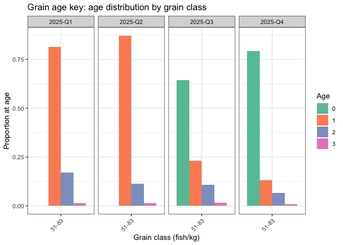

grainkey
================

<!-- README.md is generated from README.Rmd. Please edit that file -->

# Grain–Age Key Estimation

grainkey is an R package for estimating and applying grain–age keys to
fisheries data. It combines biological sampling data and commercial
sales records to estimate the age structure of catch based on grain
class (individuals per kg).

This package supports stock assessment work.

## Installation

You can install the development version of grainkey like so:

``` r
# Install the development version from GitHub
# install.packages("devtools")
devtools::install_github("mariazuba/grainkey")
```

## Quick Start

``` r
# Load biological data
data(Database)

# Build grain–age key
result <- build_grain_key(Database)

# View age composition
head(result$grain_key)
#> # A tibble: 4 × 7
#>    year quarter Grain_class `Age-0` `Age-1` `Age-2` `Age-3`
#>   <dbl>   <int> <chr>         <dbl>   <dbl>   <dbl>   <dbl>
#> 1  2025       1 51-83         0       0.814  0.171  0.0143 
#> 2  2025       2 51-83         0       0.871  0.114  0.0152 
#> 3  2025       3 51-83         0.645   0.231  0.107  0.0165 
#> 4  2025       4 51-83         0.794   0.131  0.0654 0.00935

# Plot proportion-at-age
plot_grain_key(result, plot_type = "percentage")
```



## Apply to Commercial Catch Data

``` r
data("data_NV")
notaV <- data_NV

# Estimate catch by grain class
res_default <- calc_grain_catch(notaV)

# Estimate catch-at-age
catch_by_age <- calc_catch_by_age(result$grain_key, res_default)

# Plot
plot_catch_by_age(catch_by_age)
```


## Main Functions

- `build_grain_key()` – Construct grain–age keys from biological data
- `plot_grain_key()` – Visualize age or weight distributions by grain
- `calc_grain_catch()` – Estimate number of fish caught by grain class
- `calc_catch_by_age()` – Apply grain–age key to commercial catch
- `plot_catch_by_age()` – Plot estimated catch-at-age

## Included Datasets

- Database – Simulated biological data (age, weight, date)
- data_NV – Simulated commercial sales data (kg, price, grain class)

## Vignette

[Vignette](doc/grain-key-tutorial.html)

## License and Authorship

MIT License © 2025 María José Zúñiga

Developed at IEO-CSIC as part of the BioEcon4Fish project.
